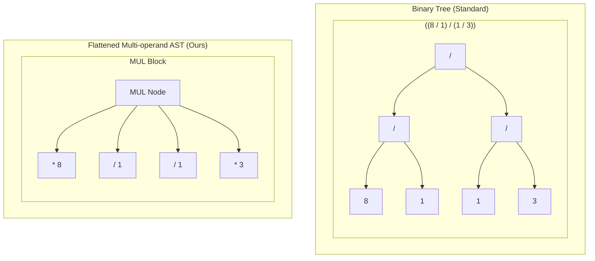

# 24-points-modern-SPA

[Skip to Chinese Version / 跳转到中文版](#chinese-version)

<p align="center">
  
  
  
  
</p>

A premium, responsive, and feature-rich 24-Point Math Game built as a zero-dependency Modern Single Page Application (SPA). It features an advanced mathematical solver powered by AST Flattening and Canonical Hashing to filter out structurally equivalent duplicate solutions.

---

## Core Features

*   **Fraction Math Engine**: Performs exact rational arithmetic, avoiding floating-point rounding errors. Capable of finding fractional solutions such as (3 - 8/3) * 8 = 24.
*   **Dynamic Drag and Drop Interaction**: A physical-feeling card collision mechanic. Drag numbers together and press W/A/S/D keys to trigger arithmetic operations (+, -, *, /).
*   **Premium Glassmorphic Themes**: Toggle between 6 curated visual aesthetics including Glass, Paper, Bamboo, Leather, Dark, and Plain White.
*   **Comprehensive I18n**: Fully localized user interface with support for English, Chinese, Spanish, German, and French.
*   **History and PDF Export**: Track performance, review history, export logs as Markdown, and print cheat-sheets or wrong-question sets directly.

---

## Algorithmic Deep Dive: Canonical Uniqueness Solver

Traditional 24-point solvers generate thousands of duplicate steps that are mathematically identical due to the commutative (a + b = b + a) and associative ((a + b) + c = a + (b + c)) properties.

This repository implements a two-stage reduction algorithm to ensure that only mathematically unique solutions are presented.

### 1. Abstract Syntax Tree (AST) Flattening
Binary operators that are associative are flattened into multi-operand nodes. Continuous additions/subtractions are merged into a single ADD node, and continuous multiplications/divisions are merged into a single MUL node.



### 2. Canonical Hashing
During the hashing phase, operands within any ADD or MUL node are sorted lexicographically based on their sub-hashes. This guarantees that no matter what the evaluation order is (e.g., 3 * 8 or 8 * 3), they map to the exact same fingerprint.

*   **Sign Normalization**: Negative expressions are normalized. For instance, the expression -(3 - 5) and (5 - 3) are automatically resolved to the same canonical representation.

```javascript
termHashes.sort(); // Lexicographical sorting guarantees commutativity
let h = "(ADD" + termHashes.join("") + ")";
return is_neg ? "-" + h : h;
```

---

## Getting Started

Since this is a client-side SPA with zero dependencies, you can run it immediately without any build step:

1. Clone this repository:
   ```bash
   git clone https://github.com/connectedGraph/24-points-modern-SPA.git
   ```
2. Open 24points.html directly in any modern web browser.

---

## Technology Stack

*   **Frontend Structure**: HTML5 Semantic Markup
*   **Styling and Themes**: CSS Custom Properties and Glassmorphism
*   **Logic Engine**: Vanilla ES6+ Javascript
*   **Solver Paradigm**: Recursive Backtracking with AST Normalization

---

## License

This project is licensed under the MIT License - see the LICENSE file for details.

---

<a name="chinese-version"></a>
# 中文版

[Back to English Version / 返回英文版](#24-points-modern-spa)

一款高端、响应式且功能丰富的 24 点数学游戏，采用无依赖的现代单页面应用（SPA）架构。它搭载了基于 AST 扁平化（AST Flattening）和标准化哈希（Canonical Hashing）的高级数学求解器，能有效过滤数学本质完全等价的重复解。

---

## 核心特性

*   **分数数学引擎**：进行精确的有理数运算，避免浮点数舍入误差。支持求解如 (3 - 8/3) * 8 = 24 这样的分数解。
*   **动态拖拽交互**：拟真的卡片碰撞机制。将数字拖拽在一起，并在拖拽过程中按下 W/A/S/D 键来决定加减乘除运算。
*   **高端毛玻璃主题**：支持 6 套精心设计的视觉主题切换，包括毛玻璃、纸质、竹风、皮革、暗黑和极简白。
*   **完整多语言支持**：完整的国际化本地界面，支持英文、中文、西班牙文、德文和法文。
*   **记录与 PDF 导出**：跟踪游戏表现、查看历史记录、将日志导出为 Markdown，并能直接打印通关指南和错题集。

---

## 算法深度解析：唯一解求解器

传统的 24 点求解器会因为加法的交换律（a + b = b + a）和结合律（(a + b) + c = a + (b + c)）产生大量在数学本质上完全相同的重复步骤。

本仓库实现了一套双阶段归约算法，确保只向用户展示在数学本质上唯一的解法。

### 1. 抽象语法树（AST）扁平化
将满足结合律的二元运算符打平成多元节点。连续的加减法被合并为一个 ADD 节点，连续的乘除法被合并为一个 MUL 节点。

在扁平化之后，即使运算的先后括号顺序不同，它们也会被统一归约到同一个多元节点下（参考英文版中的 AST 对比流程图）。

### 2. 标准化哈希
在生成哈希指纹时，对 ADD 或 MUL 节点内的所有子操作数进行字典序排序。这保证了无论输入的顺序如何（例如 3 * 8 还是 8 * 3），最终映射出的哈希指纹都完全一致。

*   **正负号标准化**：自动提取负号。例如，表达式 -(3 - 5) 和 (5 - 3) 会被归约并映射到同一个哈希指纹上。

```javascript
termHashes.sort(); // 字典序排序保证交换律一致性
let h = "(ADD" + termHashes.join("") + ")";
return is_neg ? "-" + h : h;
```

---

## 快速开始

本项目为纯前端 SPA，零依赖，无需任何构建步骤，克隆后即可直接运行：

1. 克隆本仓库：
   ```bash
   git clone https://github.com/connectedGraph/24-points-modern-SPA.git
   ```
2. 直接在任意现代浏览器中打开 24points.html 即可。

---

## 技术栈

*   **前端结构**：HTML5 语义化标签
*   **样式与主题**：CSS 变量与毛玻璃拟物化设计
*   **逻辑引擎**：原生 ES6+ Javascript
*   **求解算法**：带 AST 标准化的递归回溯算法

---

## 开源协议

本项目基于 MIT 协议开源 - 详情请参阅 LICENSE 文件。
